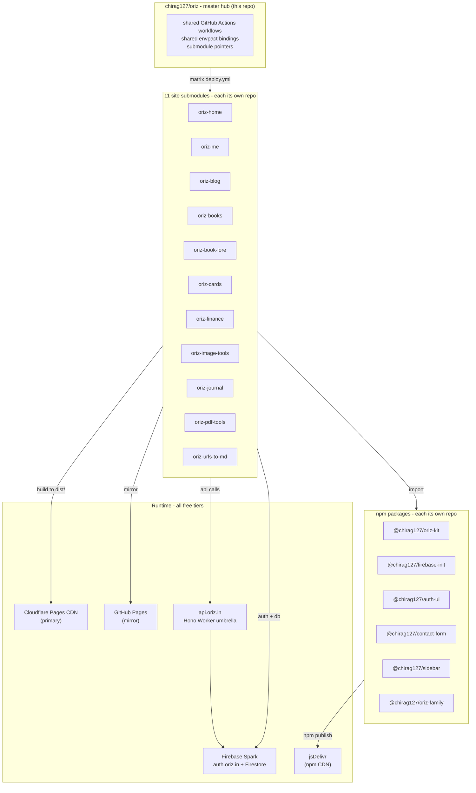

# Oriz

> **Oriz Family — 11 sites + N extensions + a reusable design kit, all free-forever, all on Cloudflare + Firebase Spark, never a card on file.**

[](#license)
[](https://github.com/chirag127/oriz/actions/workflows/deploy.yml)
[](https://github.com/chirag127/oriz/actions/workflows/ci.yml)
[](https://github.com/chirag127/oriz/commits/main)
[](https://github.com/chirag127/oriz/graphs/contributors)
[](./knowledge/index.md)
[](https://pages.cloudflare.com/)
[](https://firebase.google.com/pricing)

## What this is

**Oriz** is a free-forever family of static sites, browser extensions, and a shared design kit, all
living under the apex domain [**oriz.in**](https://oriz.in). The repository you are looking at is
the **master hub**: a monorepo whose `sites/` and `packages/` directories are git submodules — every
site and every reusable package is its own independently-shippable repo, but a single
`gh repo clone --recurse-submodules` and a single GitHub Actions matrix workflow build, deploy, and
operate the whole family. Every site is **Astro 6** with **React 19** islands, statically rendered,
served from **Cloudflare Pages** (with a **GitHub Pages** mirror per site as a free zero-config
fallback), authenticating against a single shared **Firebase Spark** project at `auth.oriz.in`. There
is **never a card on file** anywhere in the stack — Cloudflare Free, Firebase Spark, GitHub Free, and
free tiers of every supporting service. The architecture is designed to **commercialise without
re-platforming**: payment is plumbed through Razorpay, Lemon Squeezy, keygen.sh, GitHub Sponsors,
Ko-fi, UPI, and crypto when the time comes; until then the same code runs entirely free.

---

## The 11 sites

Source of truth: [`.gitmodules`](./.gitmodules).

| # | Site | Slug | Role | Live URL | Status |
|---|---|---|---|---|---|
| 1 | Landing | [`oriz-home`](https://github.com/chirag127/oriz-home) | Family hub + cross-promo | [oriz.in](https://oriz.in) | Live |
| 2 | Personal anchor | [`oriz-me`](https://github.com/chirag127/oriz-me) | 100-year personal site (resume, lifestream, projects) | [me.oriz.in](https://me.oriz.in) | Live |
| 3 | Blog | [`oriz-blog`](https://github.com/chirag127/oriz-blog) | Long-form writing (Astro + MDX) | [blog.oriz.in](https://blog.oriz.in) | Live |
| 4 | Books | [`oriz-books`](https://github.com/chirag127/oriz-books) | NCERT directory + PDF merger | [books.oriz.in](https://books.oriz.in) | Live |
| 5 | Book Lore | [`oriz-book-lore`](https://github.com/chirag127/oriz-book-lore) | 461 book summaries (Astro + MDX) | [book-lore.oriz.in](https://book-lore.oriz.in) | Live |
| 6 | Cards | [`oriz-cards`](https://github.com/chirag127/oriz-cards) | 750 India credit-card profiles | [cards.oriz.in](https://cards.oriz.in) | Live |
| 7 | Finance | [`oriz-finance`](https://github.com/chirag127/oriz-finance) | Calculators (SIP, EMI, tax, ...) | [finance.oriz.in](https://finance.oriz.in) | Live |
| 8 | Image Tools | [`oriz-image-tools`](https://github.com/chirag127/oriz-image-tools) | Browser-side image processing | [image.oriz.in](https://image.oriz.in) | Live |
| 9 | Journal | [`oriz-journal`](https://github.com/chirag127/oriz-journal) | Auth-gated PWA journal (Firestore) | [journal.oriz.in](https://journal.oriz.in) | Live |
| 10 | PDF Tools | [`oriz-pdf-tools`](https://github.com/chirag127/oriz-pdf-tools) | Browser-side PDF processing | [pdf.oriz.in](https://pdf.oriz.in) | Live |
| 11 | URLs to Markdown | [`oriz-urls-to-md`](https://github.com/chirag127/oriz-urls-to-md) | URL → MD via CF Worker | [urls-to-md.oriz.in](https://urls-to-md.oriz.in) | Live |

**Browser extensions** are catalogued separately at [`extensions.oriz.in`](https://extensions.oriz.in)
with a per-extension subdomain (e.g. `bookmarks.oriz.in`) plus a per-extension `/privacy` page —
see [`knowledge/decisions/branding/`](./knowledge/decisions/branding/) for the policy.

**Shared packages** (also submodules, in `packages/`):
[`@chirag127/oriz-kit`](https://github.com/chirag127/oriz-kit) (design system),
[`@chirag127/firebase-init`](https://github.com/chirag127/firebase-init),
[`@chirag127/auth-ui`](https://github.com/chirag127/auth-ui),
[`@chirag127/contact-form`](https://github.com/chirag127/contact-form),
[`@chirag127/sidebar`](https://github.com/chirag127/sidebar),
[`@chirag127/oriz-family`](https://github.com/chirag127/oriz-family).

---

## Services stack

Every entry below is **free** under current usage. Most have no card on file at all; the few that
require a billing account (documented exceptions only) are flagged in
[`knowledge/services/`](./knowledge/services/index.md).

| Layer | Choice | Why |
|---|---|---|
| **Hosting (sites)** | Cloudflare Pages | Unlimited free static hosting + Workers + R2; primary deploy target. |
| **Hosting (mirror)** | GitHub Pages | Per-site free zero-config fallback. |
| **Hosting (auth-gated)** | Firebase Hosting | Only `oriz-journal` — needs Firestore-backed PWA. |
| **Auth** | Firebase Authentication (Spark) | Custom domain `auth.oriz.in`; Google + Email link. |
| **DB (sync, real-time)** | Firestore (Spark) | 1 GiB / 50K reads / 20K writes per day, free forever. |
| **DB (relational warm cache)** | Turso (libSQL) | 9 GB / 1B row-reads /mo free. |
| **DB (canonical)** | JSONL in git | Lifestream + content; git is the source of truth. |
| **Compute (umbrella API)** | Cloudflare Workers + Hono | One Worker at `api.oriz.in` aggregates per-site routes via Hono RPC. |
| **CDN (npm)** | jsDelivr | Browser-side imports of `@chirag127/oriz-kit`. |
| **Search (large corpora)** | Algolia | `oriz-blog`, `oriz-books`, `oriz-book-lore` (10K records / 10K searches per mo free). |
| **Search (static)** | Pagefind | Smaller sites — 100% client-side, zero ops. |
| **Search (web)** | Multi-engine button | One UI, multiple engines (Google / DDG / Bing / Kagi public / Marginalia / Ecosia). |
| **Analytics (privacy)** | Cloudflare Web Analytics | Cookie-less, free, unlimited. |
| **Analytics (product)** | Google Analytics 4 | Free; conversion tracking. |
| **Analytics (sessions)** | PostHog | 1M events/mo free. |
| **Error tracking** | Sentry | 5K events/mo free; per-site `ENABLE_SENTRY` toggle. |
| **Forms (simple)** | Web3Forms | Browser-side only. |
| **Forms (rich)** | Tally | Unlimited free. |
| **Email (marketing)** | EmailOctopus | 2.5K subs / 10K sends/mo free. |
| **Email (transactional)** | Resend | 3K/mo free. |
| **Comments** | Giscus | GitHub Discussions backed; free, no DB. |
| **Push** | Firebase Cloud Messaging | Unlimited free. |
| **Billing (India)** | Razorpay | Primary — UPI / cards / netbanking / wallets. |
| **Billing (global)** | Lemon Squeezy | Merchant of record. |
| **Billing (license keys)** | keygen.sh | Free up to 50 active licenses. |
| **Billing (donations)** | GitHub Sponsors, Ko-fi, UPI, crypto | Lowest-friction paths. |
| **Webhook reliability** | Hookdeck | Razorpay → `api.oriz.in` retry/dedupe (100K req/mo free). |
| **AI** | Puter.js | Free user-pays gen-AI; mirrors OpenRouter model IDs. |
| **Feature flags** | Hypertune | Typed flags + A/B + Git-style config, unlimited free. |
| **CMS** | _none_ | Markdown-first, MDX where needed; content lives in git. |
| **Secrets** | envpact | One vault, every repo pulls via `envpact-cli` / `envpact-action@v0`. |
| **Code quality** | Dependabot + Biome + CodeRabbit + Sonarcloud | All free for OSS. |
| **Monitoring** | Better Stack | 10 free monitors; apex `oriz.in` only (subdomains via CF rotation). |
| **Image fallback** | Cloudinary → ImageKit | Free tiers, optional. |
| **Video** | YouTube (public) + Gumlet (privacy-sensitive) | Free; embeds. |
| **SDK docs** | Read the Docs | Free for OSS. |

Full per-service detail (rationale, free-tier limits, exit plan) lives in
[`knowledge/services/`](./knowledge/services/index.md).

---

## Architecture



---

## Hard rules (non-negotiable)

The full rule set lives in [`knowledge/rules/`](./knowledge/rules/index.md). The five hardest:

1. **Firebase Spark forever.** No Blaze upgrade — see
   [`decisions/infrastructure/firebase-spark-forever.md`](./knowledge/decisions/infrastructure/firebase-spark-forever.md).
2. **No card on file, anywhere.** Cloudflare Free / Firebase Spark / GitHub Free only — see
   [`rules/no-card-on-file.md`](./knowledge/rules/no-card-on-file.md).
3. **One branch only — `main`.** In master and every submodule — see
   [`rules/one-branch-only.md`](./knowledge/rules/one-branch-only.md).
4. **Parallel by default.** Any parallelisable work is fanned out via background subagents — see
   [`rules/parallel-fan-out-by-default.md`](./knowledge/rules/parallel-fan-out-by-default.md) and
   [`rules/parallel-by-default.md`](./knowledge/rules/parallel-by-default.md).
5. **Self-update rule.** Every chat decision lands in `knowledge/` in the same conversation — see
   [`rules/self-update-rule.md`](./knowledge/rules/self-update-rule.md).

---

## Knowledge bundle

This repo's durable, agent-consultable knowledge lives in [`knowledge/`](./knowledge/index.md) as an
**[Open Knowledge Format (OKF) v0.1](./knowledge/_okf.md)** bundle: every concept is one file with
YAML frontmatter (`type`, `title`, `description`, `tags`, `timestamp`, `format_version`, `status`,
`related`), so both humans and AI agents can locate, link, and update knowledge atomically.

Today the bundle holds **160+ concept files** across:

- [`rules/`](./knowledge/rules/index.md) — non-negotiable family-wide rules
- [`decisions/`](./knowledge/decisions/index.md) — architecture / branding / content / infra / monetisation / process / tooling decisions
- [`services/`](./knowledge/services/index.md) — every third-party service, with free-tier limits and exit plans
- [`architecture/`](./knowledge/architecture/index.md) — cross-cutting architecture
- [`policy/`](./knowledge/policy/index.md) — privacy, age-gating, terms
- [`runbooks/`](./knowledge/runbooks/index.md) — repeatable operational steps
- [`design/`](./knowledge/design/index.md) — per-site v2 design briefs
- [`glossary/`](./knowledge/glossary/index.md) — domain terms

Change history: [`knowledge/log.md`](./knowledge/log.md).

---

## Run locally

**`pnpm` is mandatory** family-wide — see [`rules/use-pnpm.md`](./knowledge/rules/use-pnpm.md). The
global pnpm store is what makes "no duplication across 11 sites" actually work.

```bash
# Clone everything (master + every site + every package)
gh repo clone chirag127/oriz -- --recurse-submodules
cd oriz

# Or, if already cloned without submodules:
git submodule update --init --recursive

# Develop a single sub-site
cd sites/oriz-blog
npx envpact-cli@latest        # hydrate .env from the shared vault
pnpm install                  # install via global pnpm store
pnpm dev                      # Astro dev server
pnpm build                    # static output to dist/
pnpm typecheck && pnpm lint
```

Need a clean reinstall across the family? See
[`runbooks/clean-install.md`](./knowledge/runbooks/clean-install.md).

---

## Deploys

All deploys run from this repo's
[`.github/workflows/deploy.yml`](./.github/workflows/deploy.yml) — sub-repos contain no deploy
workflows. The matrix deploys every site on push to `main`, on manual dispatch, and on a nightly
cron (drift safety). End-to-end runbook: [`DEPLOY.md`](./DEPLOY.md).

```bash
# deploy a single site manually
gh workflow run deploy.yml -f site=oriz-blog
```

---

## Naming convention

Every new repo slug ends in one of these suffixes — see
[`decisions/branding/repo-naming-suffixes.md`](./knowledge/decisions/branding/repo-naming-suffixes.md)
and the enforcing rule [`rules/repo-naming.md`](./knowledge/rules/repo-naming.md):

| Suffix | What it is |
|---|---|
| `-site` | A user-facing static / SSR site (e.g. `oriz-blog-site`) |
| `-ext` | A Chrome / Firefox extension |
| `-vsc-ext` | A VS Code extension |
| `-cli` | A command-line tool |
| `-worker` | A Cloudflare Worker / Durable Object |
| `-fn` | A Cloud Function (Firebase / Supabase / etc.) |
| `-data` | A data-only repo (JSONL, schemas) |

Pure npm packages keep clean scoped names (`@chirag127/oriz-kit`).

---

## Documentation map

- [**AGENTS.md**](./AGENTS.md) — single source of truth for every agent working on the family
- [**CLAUDE.md**](./CLAUDE.md) — Claude-specific pointer to AGENTS.md
- [**DEPLOY.md**](./DEPLOY.md) — end-to-end deploy runbook (PATs, DNS, AdSense, Firebase, CF)
- [**knowledge/**](./knowledge/index.md) — OKF v0.1 bundle with everything else

---

## License

**MIT** — © Chirag Singhal. (A `LICENSE` file will be added at the repo root; until then, the MIT
text in [SPDX](https://spdx.org/licenses/MIT.html) governs.)

---

## Contact

- **Web:** [oriz.in](https://oriz.in) · [me.oriz.in](https://me.oriz.in)
- **GitHub:** [@chirag127](https://github.com/chirag127)
- **Sponsor:** [GitHub Sponsors](https://github.com/sponsors/chirag127) · [Ko-fi](https://ko-fi.com/chirag127)
- **Issues:** [chirag127/oriz/issues](https://github.com/chirag127/oriz/issues) — for the master hub.
  Open issues against the specific submodule repo for site-specific bugs.
